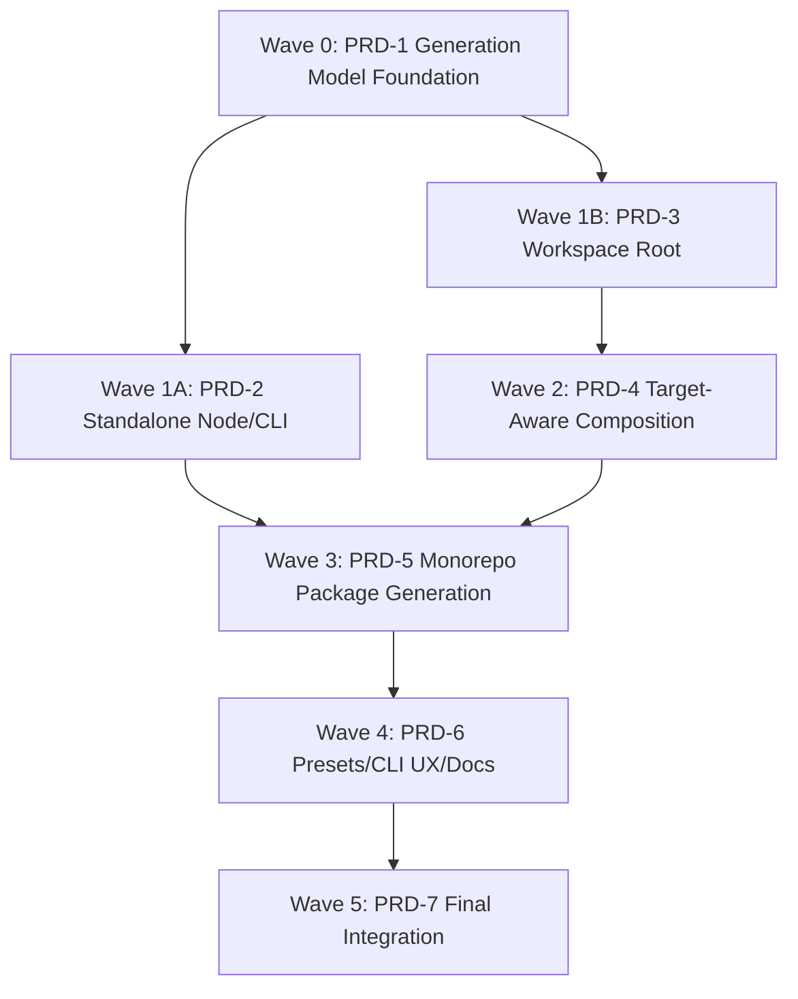

# Parallel Handoff: Monorepo And Node/CLI Roadmap

## Purpose

This handoff lets a fresh Codex session start the parallel development pipeline without the user pasting the full prior conversation.

The next agent should act as the `parallel` lead agent in the main repository. It should read the task files below, then start the correct worktree pipeline wave.

## Current State

* Repository: `/Users/sayori/Desktop/create-yume`
* Parent task: `.trellis/tasks/05-04-monorepo-node-cli-support`
* Parent task status: `planning`
* Current Trellis task in `.current-task`: `00-bootstrap-guidelines`
* Important: do not disturb unrelated uncommitted work or switch the main repo into implementation mode unless explicitly requested.
* The monorepo roadmap work is represented by a parent task plus 7 child tasks. Each child task already has:
  * `prd.md`
  * `implement.jsonl`
  * `check.jsonl`
  * `debug.jsonl`
  * `task.json`
  * planned branch name
  * initialized context
* All 7 child task contexts were validated successfully.

## Must-Read Files

Read these first:

* `.trellis/tasks/05-04-monorepo-node-cli-support/prd.md`
* `.trellis/tasks/05-04-monorepo-node-cli-support/parallel-handoff.md`
* `.trellis/workflow.md`
* `.trellis/spec/guides/index.md`

Then read the PRD for the task being dispatched.

## Child Tasks

| Phase | Task Directory | Branch | Dispatch Status |
|-------|----------------|--------|-----------------|
| PRD-1 | `.trellis/tasks/05-04-generation-model-foundation` | `codex/generation-model-foundation` | Start first |
| PRD-2 | `.trellis/tasks/05-04-standalone-node-cli-scaffolds` | `codex/standalone-node-cli-scaffolds` | Start after PRD-1 accepted |
| PRD-3 | `.trellis/tasks/05-04-workspace-root-materialization` | `codex/workspace-root-materialization` | Start after PRD-1 accepted |
| PRD-4 | `.trellis/tasks/05-04-target-aware-package-template-composition` | `codex/target-aware-package-template-composition` | Start after PRD-3 accepted |
| PRD-5 | `.trellis/tasks/05-04-monorepo-package-generation` | `codex/monorepo-package-generation` | Start after PRD-2 and PRD-4 accepted |
| PRD-6 | `.trellis/tasks/05-04-presets-cli-ux-documentation` | `codex/presets-cli-ux-documentation` | Start after PRD-5 for final UX/docs |
| PRD-7 | `.trellis/tasks/05-04-final-integration-full-acceptance` | `codex/final-integration-full-acceptance` | Final serial acceptance |

## Dispatch Waves



Rules:

* Do not start all tasks at once.
* Start Wave 0 first: `.trellis/tasks/05-04-generation-model-foundation`.
* After PRD-1 is completed and accepted, PRD-2 and PRD-3 may run in parallel.
* PRD-4 waits for PRD-3.
* PRD-5 waits for PRD-2 and PRD-4.
* PRD-6 final UX/docs waits for PRD-5, although doc drafting can happen earlier if explicitly requested.
* PRD-7 is final serial acceptance.

## First Dispatch Command

Start only Wave 0:

```bash
python3 ./.trellis/scripts/multi_agent/start.py .trellis/tasks/05-04-generation-model-foundation --platform codex
```

Monitor:

```bash
python3 ./.trellis/scripts/multi_agent/status.py
python3 ./.trellis/scripts/multi_agent/status.py --watch generation-model-foundation
```

## New Session Prompt

Use this prompt in a fresh session:

```text
[$start](/Users/sayori/Desktop/create-yume/.agents/skills/start/SKILL.md) [$parallel](/Users/sayori/Desktop/create-yume/.codex/skills/parallel/SKILL.md)

You are in /Users/sayori/Desktop/create-yume. Act as the parallel lead agent for the monorepo and Node/CLI roadmap.

Do not ask me to paste prior context. Read:
- .trellis/tasks/05-04-monorepo-node-cli-support/parallel-handoff.md
- .trellis/tasks/05-04-monorepo-node-cli-support/prd.md
- .trellis/workflow.md
- .trellis/spec/guides/index.md

Then inspect the Trellis task tree and validated child tasks. The child tasks have already been created and context-initialized.

Your job in this session:
1. Confirm the dispatch wave plan from the handoff.
2. Start only Wave 0:
   python3 ./.trellis/scripts/multi_agent/start.py .trellis/tasks/05-04-generation-model-foundation --platform codex
3. Report the started agent and monitoring commands.
4. Do not start PRD-2 or PRD-3 until PRD-1 is completed and accepted.
5. Do not implement code directly in the main repository.
6. Do not disturb unrelated uncommitted changes or the existing 00-bootstrap-guidelines current task.
```

## Lead-Agent Guardrails

* Stay in the main repository.
* Do not implement code directly.
* Do not commit.
* Do not start downstream waves early.
* Respect existing dirty worktree state.
* Use child task PRDs and jsonl context files as the source of truth.
* If a pipeline agent reports completion, review status and only then decide whether the next wave can start.
