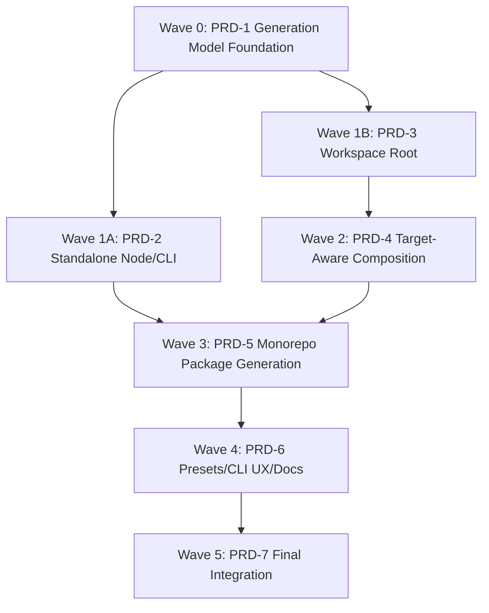
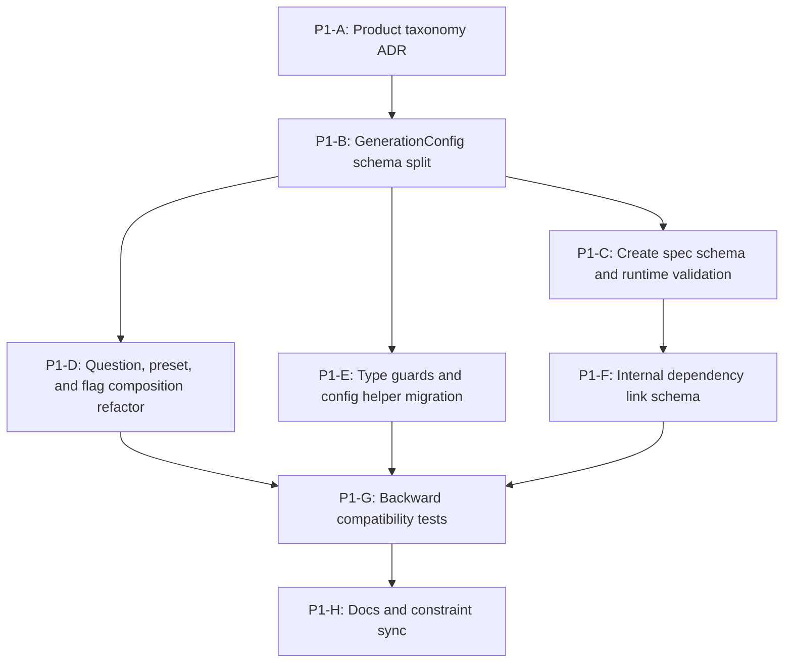
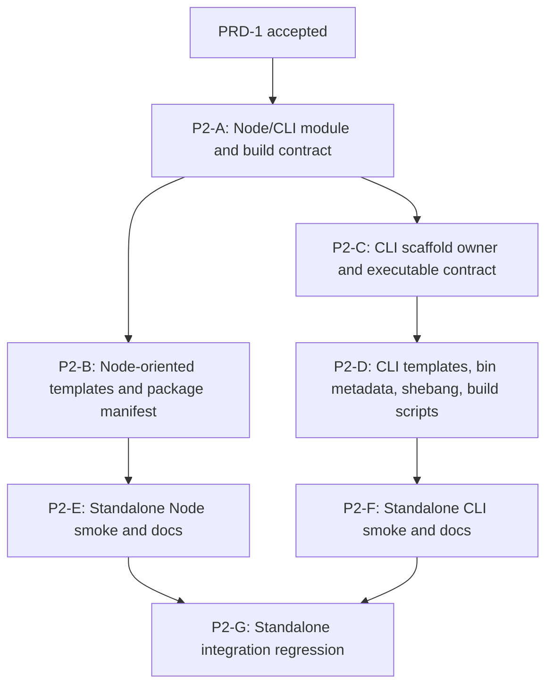
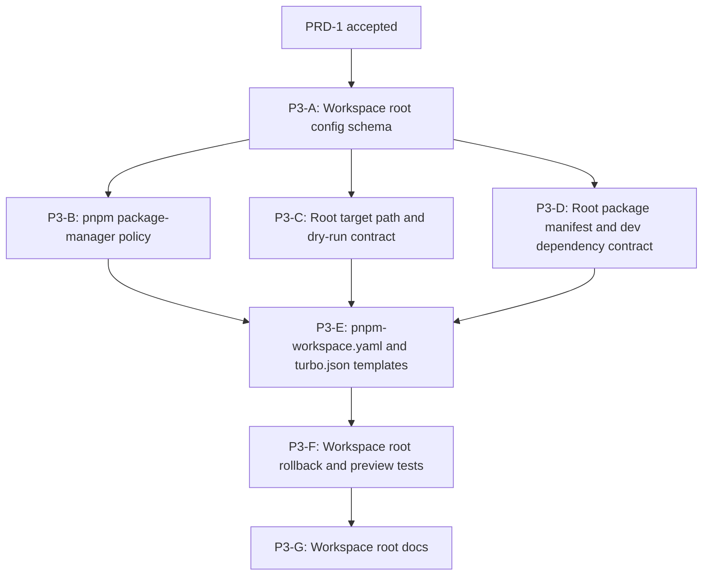
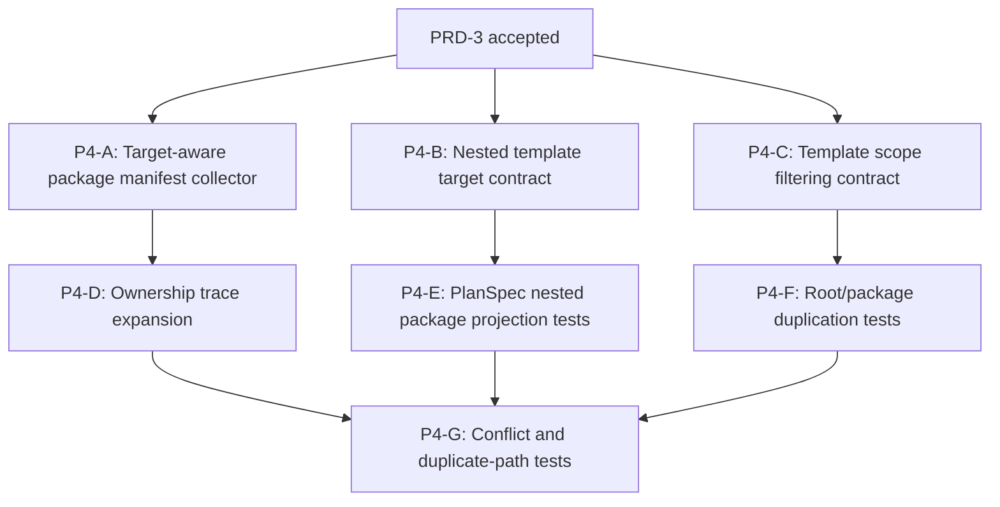
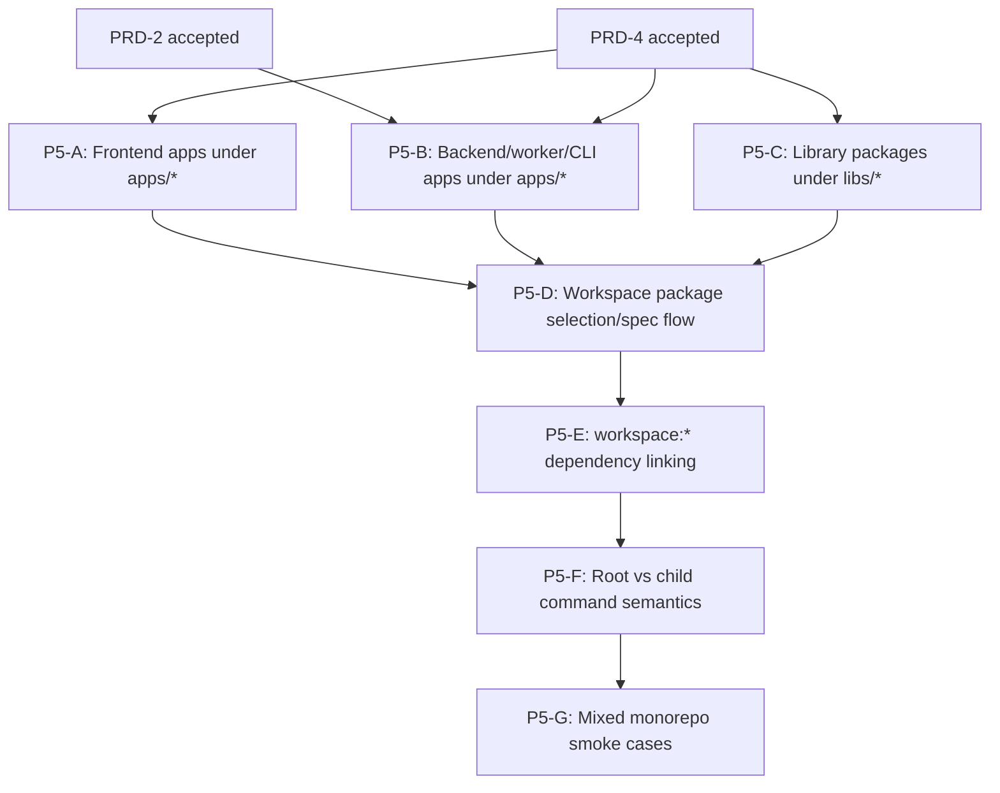
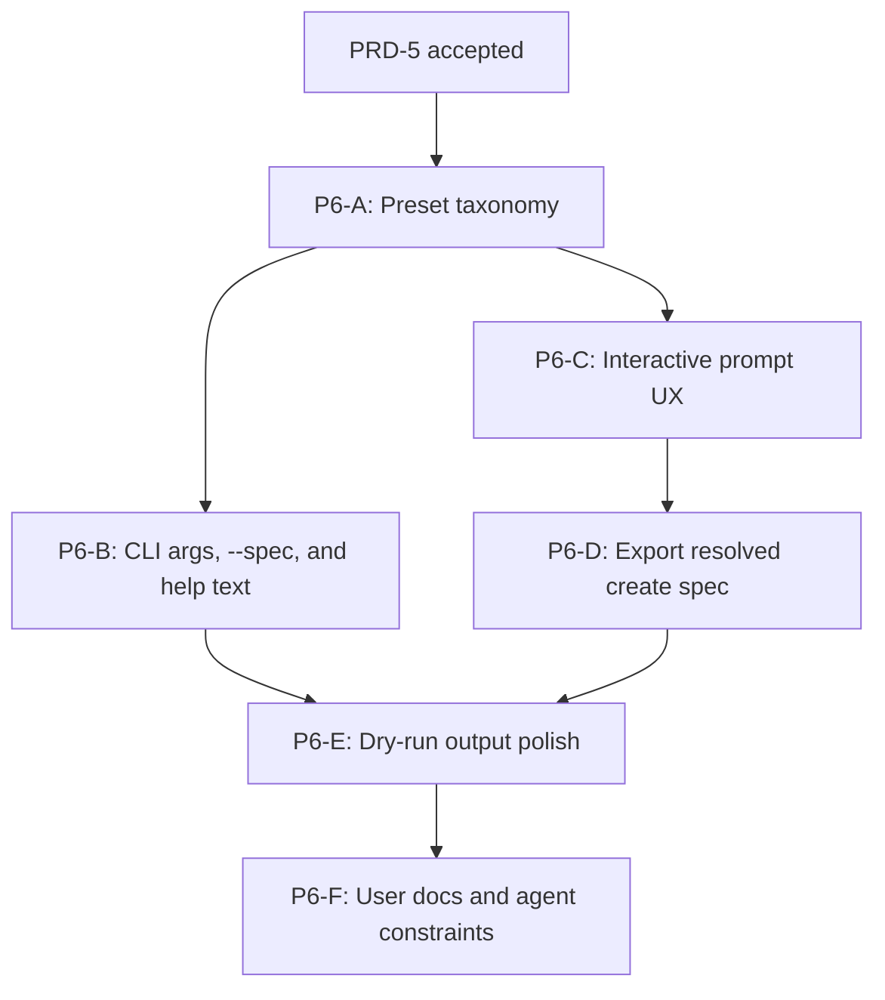
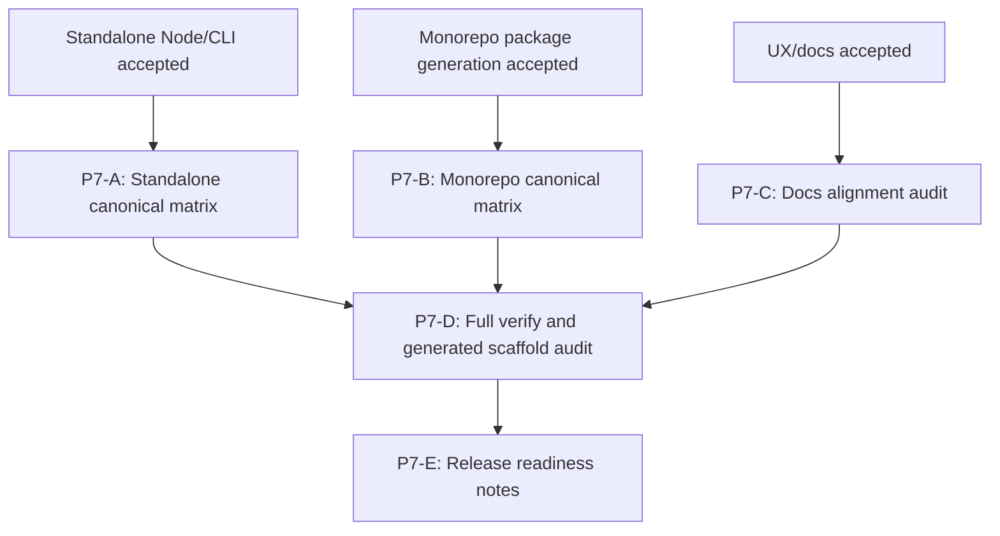

# Lead PRD: monorepo and Node/CLI roadmap decomposition

## Goal

Define the complete staged roadmap for expanding create-yume from a frontend-only project generator into a generator that supports personal Node full-stack project scaffolds, CLI tool scaffolds, shared libraries, and monorepo workspaces. This PRD is not a single implementation task. It is a lead-agent planning artifact whose output is a sequence of downstream PRDs, task directories, context files, and dispatch plans for worktree agents.

The final business goal should be accepted as a complete product capability, but implementation must be decomposed into smaller tasks. Each downstream task gets its own PRD, acceptance criteria, validation scope, and parallelization boundary.

## Lead-Agent Role

* Act as the main-repository lead agent for requirements clarification, roadmap design, task decomposition, and worktree dispatch.
* Do not implement code directly from this umbrella PRD.
* Convert clarified requirements into downstream phase PRDs and task PRDs.
* Keep task boundaries narrow enough that worktree agents can implement independently.
* Preserve a global acceptance view so the staged work still converges to the complete monorepo + Node/CLI product goal.

## What I already know

* The current product boundary only supports React and Vue project scaffolds.
* The user wants project selection to move beyond frontend-only choices and introduce Node full-stack package kinds.
* Monorepo support is a critical business change that will affect the main creation flow.
* The user expects this to be decomposed across multiple iterations, not completed in one pass.
* The primary user is currently the repository owner, not a broad public audience.
* The intended future use is a personal Node full-stack project group containing many projects, such as personal blog, DocWarden, Symphony, and Context.
* The product should generate projects with a shared engineering foundation and consistent infrastructure instead of repeatedly recreating linting and other foundations by hand.
* The generated projects should feel like opinionated personal projects with the user's own style and infrastructure choices, not neutral generic starter templates.
* The important main flow is interactive CLI usage and non-interactive parameter-driven usage; non-interactive usage is especially important because the user expects to ask a large model to call create-yume with explicit arguments.
* Repeated CLI creation across projects is a core scenario: for example, DocWarden and Symphony may each need their own CLI with the same engineering foundation.
* Backend and other Node full-stack layers should have reserved architectural positions even if their concrete templates are implemented later.
* Existing docs explicitly list Node project scaffolding, remote templates, plugin sources, and incremental updates to existing projects as out of scope today.
* `apps/cli/src/core/questions/project-type.ts` currently exposes only `vue` and `react`.
* `apps/cli/src/schema/project-config.ts` models `ProjectType` as only `vue | react`.
* `apps/cli/src/schema/preset.ts` currently supports only `react-minimal`, `react-full`, `vue-minimal`, and `vue-full`.
* Current generated paths assume one target directory equals one project root.
* The existing `WorkspaceBootstrapOwner` owns single-project root concerns today: lint config, Git, code quality hooks, post-generate commands, and root `package.json` mutations.
* `PlanSpec`, dry-run preview, and rollback are stable execution boundaries that should be preserved while expanding the product surface.
* The user corrected that this is not "choose the first MVP"; the current PRD exists to generate later-stage PRDs.
* The final target must be fully accepted across phases, but every decomposed task should define its own acceptance point.
* External reviews agreed that key missing decisions were dependency management, package manager scope, Node/CLI module/build strategy, template scope filtering, workspace dependency linking, structured spec export, canonical test combinations, and append-ready monorepo design.
* The user accepts `libs/*` as the library folder convention instead of `packages/*`.

## Assumptions (temporary)

* "Node full-stack" includes CLI tooling now and should reserve space for future backend app, worker, and shared package scaffolds.
* "Monorepo support" means generating a workspace root with one or more runnable apps under `apps/*` and shared libraries under `libs/*`, not modifying an existing repository.
* The roadmap should likely preserve existing React/Vue single-app behavior while expanding toward new project shapes.
* The first useful output of this lead PRD is a staged PRD map, not implementation.

## Open Questions

No blocker-level questions remain for this lead PRD. Downstream PRDs may still ask local questions for concrete template choices.

## Requirements (evolving)

* Produce a staged roadmap that covers the complete monorepo + Node/CLI product goal.
* Generate downstream PRDs for each stage or task instead of treating this umbrella PRD as an implementation unit.
* Each downstream PRD must include its own scope, acceptance criteria, validation commands, affected docs, and out-of-scope boundaries.
* Identify which tasks can run in parallel worktrees and which tasks must be serialized because of shared schema, PlanSpec, template, or docs contracts.
* Preserve explicit out-of-scope boundaries for capabilities not intended in the full roadmap.
* Keep existing React/Vue behavior and current stable execution core visible as compatibility requirements unless a later decision explicitly changes them.
* The first lead-agent deliverable is the downstream PRD list plus each phase's subtask DAG.
* Treat CLI project creation as a core scenario, not a secondary add-on.
* Support model-driven non-interactive execution by making CLI args and presets explicit, stable, and complete enough for LLM-driven invocation.
* Use structured create spec as the canonical non-interactive interface for complex workspace generation.
* Preserve necessary CLI flags for simple and common CLI usage.

## Acceptance Criteria (evolving)

* [ ] This lead PRD defines the overall product acceptance target for Node full-stack package kinds, CLI, and monorepo support.
* [ ] This lead PRD defines the phase map for downstream PRDs.
* [ ] Each downstream task has a clear local acceptance point and validation scope.
* [ ] The roadmap identifies serial dependencies versus safe parallel worktree boundaries.
* [ ] The roadmap identifies docs and agent constraint updates required by each phase.
* [ ] The roadmap avoids treating monorepo support or CLI support as a single oversized implementation task.
* [ ] The downstream PRD list includes dependency ordering, local acceptance points, and worktree parallelization notes.

## Definition of Done (team quality bar)

* Downstream PRDs exist for the agreed phases/tasks.
* Each downstream PRD has task-local acceptance criteria and validation commands.
* Context files are configured before worktree agents are dispatched.
* Worktree agents are started only after their PRDs are narrow and implementable.
* Final integration includes full relevant verification across schemas, generated output, dry-run preview, docs, and smoke coverage.

## Out of Scope (explicit)

* Implementing the feature directly from this umbrella PRD.
* Dispatching worktree agents before the downstream PRD map is accepted.
* Remote templates.
* Pluginized or third-party template sources.
* Incremental updates to an existing project, unless explicitly brought into scope later.
* Full support for npm, yarn, or bun workspaces in the initial roadmap.
* Serverless deployment presets, bundling-for-deployment matrices, and cloud provider deployment templates.
* Library publishing/versioning workflows beyond local workspace dependency links.

Important future-proofing note:

* Although incremental updates are out of scope, workspace root and child package generation should be designed to be target-aware, idempotency-friendly, and append-ready. Future "add package to existing workspace" support should not require rewriting the root/package separation model.

## Product Vision

create-yume should become a personal Node full-stack project factory for the repository owner. It should help create a coherent group of projects that share the same engineering foundation, conventions, and taste.

The product is not trying to be a generic template marketplace. The target experience is: when the user creates a new personal project, CLI, package, or future backend service, create-yume can materialize the familiar foundation immediately so the user and coding agents can start from the same known project shape every time.

Representative future projects include:

* Personal blog.
* DocWarden.
* Symphony.
* Context.

The shared foundation should make repeated project creation feel natural:

* Shared linting/code quality setup.
* Shared package manager and workspace conventions.
* Shared CLI package conventions when multiple projects need command-line tools.
* Reserved architecture slots for future backend/worker layers.
* Future optional AI infrastructure.

## Product Taxonomy Decision

Do not use `node` as the top-level user-facing project choice. `node` is a runtime/platform dimension, not the thing the user is primarily creating.

Use a shape/kind/runtime taxonomy. Keep framework/tooling choices package-kind-specific instead of forcing one global `framework` field to mean unrelated things across frontend, backend, CLI, and libraries.

```text
shape: 'standalone' | 'workspace'

packageKind:
  | 'frontend-app'
  | 'backend-app'
  | 'cli-tool'
  | 'library-package'
  | 'worker-app'

runtime:
  | 'browser'
  | 'node'
  | 'neutral'

frontendFramework:
  | 'react'
  | 'vue'

backendFramework:
  | 'hono'
  | 'fastify'
  | 'nest'
  | 'none'

cliToolkit:
  | 'none'
  // future: 'cac' | 'commander' | 'clipanion' | 'clack'
```

Initial meaning:

* `frontend-app` is a browser-facing application, currently React or Vue.
* `cli-tool` is a first-class package kind that usually runs on Node and owns executable entrypoint, npm `bin`, shebang, command parsing, build, and invocation tests.
* `backend-app` means a Node service application that starts a service process, usually HTTP/API first.
* `worker-app` means a Node background process, such as a queue consumer, scheduled task runner, webhook/event processor, crawler, indexer, or other non-HTTP long-running job.
* `library-package` means shared code consumed by other packages; it may be Node-only, browser-only, or runtime-neutral depending on its API surface.
* `workspace` is the generated container shape that can hold multiple apps/packages under a shared root foundation.
* Framework/toolkit choices are interpreted only inside their package kind. For example, Hono/Fastify/Nest belong to `backend-app`, while React/Vue belong to `frontend-app`.

Runtime inference and validation:

* `frontend-app` infers `runtime: 'browser'`.
* `backend-app`, `worker-app`, and `cli-tool` infer `runtime: 'node'`.
* `library-package` may use `runtime: 'neutral'`, `runtime: 'node'`, or a future browser-specific mode depending on its public API.
* User-facing prompts and simple flags should not ask for runtime when it can be inferred from `packageKind`.
* Structured create spec decoding must reject impossible combinations, such as `backend-app` with `runtime: 'browser'`.

## Workspace Structure Decision

Use Nx-style workspace grouping for generated monorepos:

```text
<workspace>/
  package.json
  pnpm-workspace.yaml
  turbo.json
  apps/
    <frontend-app>/
    <backend-app>/
    <worker-app>/
    <cli-tool>/
  libs/
    <library-package>/
```

Decision:

* `apps/*` contains runnable entrypoints: frontend apps, backend apps, worker apps, and CLI tools.
* `libs/*` contains shared library packages consumed by apps or other libs.
* Standalone generation still creates a single project root and does not introduce `apps/` or `libs/`.
* The previous generic `packages/*` wording should be replaced in downstream PRDs with `libs/*` when referring to library packages.

Rationale:

* The folder names make the runnable-vs-shared distinction visible.
* `cli-tool` stays first-class while still being treated as a runnable app in workspace layout.
* The layout leaves a natural future path for backend, worker, and library expansion without changing the top-level workspace shape.

## Dependency Management Decision

Use a pnpm-first, single-version workspace policy for the initial roadmap.

Decision:

* Generated workspaces are pnpm workspaces in the initial roadmap.
* Root `pnpm-workspace.yaml` should include `apps/*` and `libs/*`.
* Root `package.json` owns workspace-level dev tooling and orchestration dependencies, such as linting, Husky, Commitlint, lint-staged, CI helpers, Turborepo, shared TypeScript/build tooling, and future root-only engineering infrastructure.
* Child app/lib `package.json` files own runtime dependencies and package-local scripts.
* Shared dependency versions should be centralized through pnpm catalog entries when generated workspaces need repeated versions across packages.
* Internal workspace dependencies must be explicit in the structured create spec and should be emitted as `workspace:*` dependencies.
* Do not auto-link every local package to every app. Link only declared internal dependencies.
* Package-manager commands such as install, add, exec, and workspace-root operations should be centralized behind a package-manager policy/helper instead of being scattered as raw `pnpm` strings.

Out of current scope:

* npm, yarn, and bun workspace generation.
* Independent per-package external dependency version policies.
* Library publishing/versioning strategy.

Rationale:

* The source repository already uses pnpm workspaces and catalog-style dependency centralization.
* A single-version policy fits a personal project factory better than independent versions.
* Centralizing package-manager commands keeps future package-manager support possible without pretending it exists now.

## Node And CLI Build Decision

Use TypeScript ESM and a tsdown-oriented build baseline for generated Node and CLI packages in the initial roadmap.

Decision:

* Generated Node-oriented packages should default to `"type": "module"`.
* Generated Node-oriented packages should target the supported Node engine baseline already used by create-yume unless a downstream PRD updates that baseline explicitly.
* Generated CLI tools must include an executable entrypoint, npm `bin` metadata, a shebang, build script, and an invocation smoke test.
* CLI output should be buildable before invocation; source files should not be the only executable artifact.
* Initial CLI toolkit may be `none` or a minimal local command parser. External CLI toolkit choices are future additions.
* Generated Node/CLI packages should use a single documented build path, initially aligned with the repository's tsdown usage unless a downstream PRD records a better fit.

Deferred:

* CJS output support.
* Deployment bundling matrices.
* Serverless-specific packaging.
* Alternative build tools beyond the initial selected path.

Rationale:

* CLI packages fail in very concrete ways when ESM/CJS, shebang, `bin`, and build output are vague.
* A narrow build strategy avoids generating projects that appear valid but cannot be invoked reliably.
* Keeping alternatives deferred prevents Phase 2 from becoming a generic Node build-tool research project.

## Template Scope Filtering Decision

Monorepo generation must distinguish root-scoped templates from package-scoped templates.

Decision:

* Every template registry entry or contribution should be associated with an intended scope before monorepo package generation depends on it.
* `root` templates apply to standalone project roots or workspace roots.
* `package` templates apply to child apps/libs inside a workspace.
* `both` templates must explicitly define which pieces are emitted at root and which pieces are emitted in child packages.
* Existing workspace bootstrap templates such as lint config, Git ignore, Husky hooks, Commitlint, lint-staged, and workspace orchestration should be reviewed before they are reused in workspace child packages.
* Template assembly should filter by target scope rather than relying on each package kind to remember which root-owned files to omit.

Rationale:

* Current frontend assembly composes shared frontend templates with workspace bootstrap templates for standalone projects. That is valid for one-root generation but would duplicate root files inside `apps/*` if reused blindly.
* Scope filtering keeps root/package separation visible in dry-run, PlanSpec projection, package manifest ownership, and generated output tests.
* This is required before mixed monorepo package generation is safe.

## Non-Interactive Input Decision

Use a structured create spec as the primary interface for complex non-interactive generation, especially workspace/monorepo generation.

Decision:

* Simple standalone flows may continue to support flags and presets.
* Complex workspace flows should be represented by a serializable create spec file or JSON payload, e.g. `create-yume --spec create-yume.json`.
* The spec should be schema-decoded before planning and should share the same generation model used by interactive questions.
* Dry-run should be available for spec input and should preview the same `PlanSpec` boundary as interactive/flag input.
* Flags should remain available for basic CLI ergonomics, but flags should not become a sprawling representation of nested workspace package graphs.
* Interactive flows should eventually be able to export the resolved create spec, so a manually configured session can become a reusable model-driven input.
* Prompts should only be used in interactive contexts. Non-interactive execution should either receive complete input through flags/spec or fail with a clear schema/input error.
* A `--no-input`-style behavior should be considered in PRD-6 to make model/CI invocation explicit.

Rationale:

* A structured spec is a deeper interface for LLM-driven invocation: the model can generate one coherent object instead of a fragile long command.
* It reduces CLI argument explosion as workspace package combinations grow.
* It preserves a stable serialization boundary that can be tested, documented, previewed, and reused by agents.
* Exporting resolved spec creates a closed loop: interactive input, structured config, dry-run, and generation all prove the same schema.
* It aligns with the existing strength of the codebase: schema decoding, PlanSpec projection, dry-run, and stable core services.

Initial spec shape requirements:

* A workspace spec must contain a package list with stable package ids, names, package kinds, inferred/validated runtime, package-kind-specific framework/toolkit choices, and engineering infrastructure capabilities.
* A package spec may declare internal workspace dependencies by package id or package name.
* A package spec must not rely on implicit "link everything" behavior.
* The decoded spec should be the canonical input to planning, whether it came from a file, JSON payload, preset, flags, or interactive questions.

## Engineering Infrastructure Capabilities

Avoid the name "Baseline" for the user-facing concept. Model shared project infrastructure as optional engineering capabilities that can be composed into project kinds and presets.

Initial capability groups:

* `code-quality`: linting, Husky, Commitlint, lint-staged, and related quality gates already present in the current project.
* `ai-infra`: reserved capability group for future AI-oriented project infrastructure.
* `ci`: reserved optional capability group for future CI workflow generation.
* `build`: reserved capability group for package-kind-specific build tooling, initially most concrete for Node/CLI packages.
* `test`: reserved capability group for future test scaffolding, smoke hooks, or Vitest-style unit test setup.

Capability scope:

* `root`: applies to the generated standalone project root or monorepo workspace root.
* `package`: applies to one child package/app inside a workspace.
* `both`: has coordinated root and package pieces.

For monorepo work, every engineering infrastructure capability must declare its scope before implementation. This prevents root-level concerns such as Husky or workspace lint orchestration from leaking into child package templates, and prevents package-level runtime dependencies from being installed at the workspace root by accident.

Initial scope guidance:

* `code-quality` is usually `both`: root owns Git hooks and workspace orchestration; packages may own lint-relevant local config only when needed.
* `ci` is usually `root`.
* `ai-infra` is reserved and must define its own scope before implementation.
* `build` is usually `package`, with root orchestration only when generating a workspace.
* `test` is usually `package`, with root orchestration only when generating a workspace.

Deferred capability groups:

* `docs-style`: do not expand yet.

Preset direction:

* Preserve template-composition thinking from React/Vue.
* Add presets that combine shape, package kind, runtime, package-kind-specific framework/toolkit choices, and engineering infrastructure capabilities.
* A future "Create-Trellis-like" preset can compose Effect-oriented infrastructure as an optional capability rather than forcing it into every project.

## Design Review Notes

### First-Principles Check

The core job is not "support more templates"; it is "materialize a coherent personal Node full-stack project foundation repeatedly." The taxonomy should therefore optimize for the user's creation intent:

* `shape`: am I creating one project or a workspace that contains multiple packages?
* `packageKind`: what kind of thing am I creating?
* `runtime`: where does it execute?
* package-kind-specific framework/toolkit: what ecosystem flavor does this kind use?
* engineering infrastructure capabilities: which optional shared project systems are composed in?

This keeps `node` from becoming a vague top-level bucket and keeps CLI/backend/library choices user-meaningful.

### Software Design Philosophy Check

The roadmap should follow deep-module and information-hiding principles:

* Stable execution core stays deep: `PlanService`, `PlanSpec`, `TemplateEngineService`, `FsService`, and rollback semantics remain preserved unless evidence says otherwise.
* Product taxonomy should not leak into every module as raw string checks. Downstream PRDs should introduce owner/helper boundaries so common generation paths stay simple.
* Avoid temporal decomposition. The phase DAG is a planning tool, not a command to create modules named after phases.
* Infrastructure capabilities must have owners and scopes; otherwise `code-quality`, `ai-infra`, `ci`, and future Effect presets can become a shallow cross-cutting switchboard.
* Non-interactive usage for large workspaces should use a structured config/spec boundary rather than an explosion of CLI flags.

## External Review Incorporation

Accepted into the roadmap:

* Use `apps/*` and `libs/*` for generated workspace layout.
* Adopt an initial pnpm-only workspace policy with centralized dependency version management.
* Put root-level dev tooling at the workspace root and runtime dependencies in child package manifests.
* Model explicit internal workspace dependency links and emit `workspace:*`.
* Define Node/CLI ESM/build/bin/shebang expectations before implementing CLI templates.
* Add template scope filtering so root-only templates are not repeated inside child apps/libs.
* Add structured spec export as a later UX/docs task.
* Define canonical final smoke combinations.
* Keep monorepo generation append-ready even though existing-project incremental update remains out of scope.
* Infer and validate runtime from package kind where possible.

Rejected or deferred:

* Do not implement a plugin/extensibility API in this roadmap.
* Do not support remote template sources in this roadmap.
* Do not support npm/yarn/bun workspace generation initially.
* Do not include serverless deployment templates initially.
* Do not include library publishing/versioning initially.

## Technical Notes

* Task created at `.trellis/tasks/05-04-monorepo-node-cli-support`.
* Relevant constraints read: `docs/agent/constraint/roadmap.md`, `docs/agent/constraint/architecture.md`, `docs/user/system-architecture.md`.
* Likely impacted areas include project config schemas, project type questions, presets, template registries, PlanSpec projection, workspace bootstrap, generated package manifests, dry-run output, and docs.
* Repo files inspected include `apps/cli/src/core/questions/compose.ts`, `apps/cli/src/core/services/compose.ts`, `apps/cli/src/core/workspace-bootstrap.ts`, `apps/cli/src/core/modifier/package-json.ts`, `apps/cli/src/core/template-registry/frontend-app.ts`, `apps/cli/src/core/template-registry/workspace-bootstrap.ts`, `apps/cli/src/schema/project-config.ts`, `apps/cli/src/schema/preset.ts`, and relevant tests.
* Current repository already uses pnpm workspaces and Turborepo for itself: `pnpm-workspace.yaml` has `apps/*` and `packages/*`; `turbo.json` defines root tasks. Generated workspaces in this roadmap should use `apps/*` and `libs/*` by decision.

## Research Notes

### What similar tools do

* Vite's creator flow keeps scaffolding centered on project name plus template selection, with non-interactive template flags and generated scripts such as `dev`, `build`, and `preview`. Vite also notes that monorepo setups are possible, but the core create flow remains template-oriented. Source: https://vite.dev/guide/
* Turborepo's create flow starts from a repository/workspace concept, not a single framework app concept. Official guidance recommends `apps/*` for applications/services and `packages/*` for libraries/tooling, with `pnpm-workspace.yaml` and `turbo.json` at the root. Source: https://turborepo.dev/docs/crafting-your-repository/structuring-a-repository
* Nx separates workspace type and preset concepts; its official presets include standalone React/Vue/Node choices and monorepo variants such as React monorepo, Vue monorepo, and Node monorepo. Source: https://nx.dev/docs/reference/create-nx-workspace
* pnpm workspaces require a root `pnpm-workspace.yaml`; `workspace:*` dependencies intentionally resolve only to local workspace packages. Source: https://pnpm.io/workspaces
* npm CLI packages use the `bin` field for executable entry points, and npm expects referenced bin files to start with `#!/usr/bin/env node`. Source: https://docs.npmjs.com/cli/v11/configuring-npm/package-json/

### Constraints from our repo/project

* Existing docs currently say Node scaffolding and monorepo generation are unsupported, so any implementation must update user docs and agent constraints in lockstep.
* The stable execution core already supports writing nested relative paths, JSON/text mutations, post-generate commands, dry-run projection, and rollback. Monorepo support should probably reuse those units instead of replacing the planner.
* The current `ProjectConfig` union conflates product family and project root shape. Monorepo support likely needs a higher-level config such as "generation target" or "workspace shape" before individual app/package configs.
* Existing package manifest contribution logic targets `package.json` at root only. Monorepo support will need target-path-aware package manifest contributions, e.g. root `package.json`, `apps/web/package.json`, `apps/api/package.json`, `apps/cli/package.json`, or `libs/*/package.json`.
* `WorkspaceBootstrapOwner` currently means "single generated project root bootstrap"; with monorepo, it may need to mean "generated workspace root bootstrap" and avoid leaking root-only behavior into child apps.

### Roadmap decomposition options

**Option A: Product-capability phases**

* Shape: Node full-stack package-kind support, CLI scaffold support, monorepo root support, full-stack/combined workspace support.
* Pros: easy to communicate as product milestones.
* Cons: may hide shared architecture dependencies that need to land first.

**Option B: Architecture-layer phases**

* Shape: config/schema model, target-path/package-manifest model, template registries, generated templates, commands/dry-run, docs/tests.
* Pros: good for reducing breakage in shared contracts.
* Cons: less meaningful to users because product value appears late.

**Option C: Hybrid dependency roadmap** (Recommended)

* Shape: first define shared architecture contracts, then split product capabilities into independently acceptable PRDs, then run integration PRDs that prove combinations.
* Pros: gives users visible capability increments while keeping shared boundaries sane for worktree agents.
* Cons: requires the lead PRD to maintain a task graph, not just a linear checklist.

## Output Contract

This lead PRD should produce the following artifacts before any implementation dispatch:

* A downstream phase PRD list.
* A subtask DAG for each phase.
* A global acceptance target that proves the full roadmap, not just one isolated milestone.
* A dispatch policy that tells the lead agent which tasks can run in parallel worktrees and which tasks are serialized.
* A context policy for `implement`, `check`, and `finish` agents so each downstream task starts with the right specs, docs, and affected files.
* A handoff document for fresh sessions: `.trellis/tasks/05-04-monorepo-node-cli-support/parallel-handoff.md`.

## Global Acceptance Target

The roadmap is complete only when create-yume can support these product capabilities together:

* Existing standalone React and Vue generation remains compatible with current preset, dry-run, rollback, docs, and smoke expectations.
* Node full-stack standalone package kinds exist with first-class schema, question, preset or non-interactive support, templates, package manifest contributions, tests, and docs.
* CLI project generation exists as a first-class product capability with executable entrypoint, npm `bin` metadata, shebang handling, scripts, tests, and docs.
* Monorepo generation exists as a first-class project shape with workspace root files, nested `apps/*` and `libs/*`, root package manifest, child package manifests, package manager workspace metadata, task orchestration metadata, dry-run visibility, rollback behavior, smoke coverage, and docs.
* Monorepo generation can combine supported frontend, backend, worker, CLI, and library package kinds without corrupting root-vs-child ownership boundaries.
* Root-level bootstrap concerns and child package concerns are separated in ownership traces, package manifest mutation, post-generate commands, and docs.
* Structured create spec input is available for complex workspace generation, and exported/resolved spec examples are documented for model-driven invocation.
* Workspace internal dependencies are explicit and validated, then emitted as `workspace:*` links.

## Canonical Verification Matrix

Use canonical combinations to control test scope and avoid unbounded matrix growth.

Standalone canonical cases:

* React frontend app with Vite.
* Vue frontend app with Vite.
* CLI tool with TypeScript ESM, build output, `bin`, shebang, and invocation smoke.
* Backend app placeholder once backend scaffolding becomes concrete.

Workspace canonical cases:

* React frontend app + backend app + neutral shared library.
* Multiple CLI tools in one workspace.
* Frontend app + CLI tool + neutral shared library with explicit `workspace:*` dependency links.

Dry-run canonical checks:

* Spec input dry-run writes nothing.
* Root files and child package files are shown separately enough to audit.
* Root-level post-generate commands/actions and child package tasks keep ownership traces.

Compatibility checks:

* Existing React/Vue standalone snapshots and smoke cases stay green.
* Docs and agent constraints match the current supported scope after each phase.

## Downstream PRD Map

### PRD-0: Lead Roadmap And Dispatch Plan

* Directory: current task, `.trellis/tasks/05-04-monorepo-node-cli-support`.
* Purpose: own the global roadmap, downstream PRD generation, task DAG, and worktree dispatch decisions.
* Depends on: user requirements and lead-agent research.
* Local acceptance:
  * The roadmap lists complete phases and downstream PRDs.
  * Every phase has a subtask DAG.
  * Every task has local acceptance, validation scope, and parallelization notes.

### Generated Child Task Directories

The lead roadmap has been expanded into concrete Trellis child tasks:

| Phase | Task Directory | Branch | Dispatch Status |
|-------|----------------|--------|-----------------|
| PRD-1 | `.trellis/tasks/05-04-generation-model-foundation` | `codex/generation-model-foundation` | Ready after human approval |
| PRD-2 | `.trellis/tasks/05-04-standalone-node-cli-scaffolds` | `codex/standalone-node-cli-scaffolds` | Blocked on PRD-1 |
| PRD-3 | `.trellis/tasks/05-04-workspace-root-materialization` | `codex/workspace-root-materialization` | Blocked on PRD-1 |
| PRD-4 | `.trellis/tasks/05-04-target-aware-package-template-composition` | `codex/target-aware-package-template-composition` | Blocked on PRD-3 |
| PRD-5 | `.trellis/tasks/05-04-monorepo-package-generation` | `codex/monorepo-package-generation` | Blocked on PRD-2 and PRD-4 |
| PRD-6 | `.trellis/tasks/05-04-presets-cli-ux-documentation` | `codex/presets-cli-ux-documentation` | Blocked on PRD-5 for final UX/docs, can draft earlier |
| PRD-7 | `.trellis/tasks/05-04-final-integration-full-acceptance` | `codex/final-integration-full-acceptance` | Final serial acceptance |

Each child task has its own `prd.md`, initialized context files, scope, and planned branch name.

### Parallel Dispatch Waves



Dispatch rules:

* Wave 0 is serial because it changes shared schemas and config contracts.
* Wave 1 can run PRD-2 and PRD-3 in parallel after PRD-1 is accepted.
* PRD-4 waits for PRD-3 because it depends on root/package target contracts.
* PRD-5 waits for PRD-2 and PRD-4 because it composes product packages inside workspace targets.
* PRD-6 can draft docs/spec examples earlier, but final implementation should wait until PRD-5 stabilizes user-visible behavior.
* PRD-7 is serial final acceptance and should not start until all product/UX phases are green.

### PRD-1: Generation Model Foundation

* Purpose: split the current frontend-only `ProjectConfig` model into a broader generation model that can describe standalone projects, future workspaces, and structured create spec input.
* Likely scope: `apps/cli/src/schema/`, question composition, preset schema, structured spec schema, runtime inference/validation, internal dependency link schema, CLI help, type guards, config tests, docs constraints.
* Depends on: PRD-0.
* Local acceptance:
  * Existing React/Vue configs still decode and generate unchanged output.
  * New naming/model contracts are documented before product templates depend on them.
  * Structured create spec decoding exists as a planned boundary before complex workspace generation depends on it.
  * Runtime is inferred or validated from `packageKind` instead of being a redundant prompt burden.
  * Workspace package specs can declare internal dependencies by package id/name.
  * Tests prove the new model preserves current single-project behavior.

### PRD-2: Standalone Node And CLI Scaffolds

* Purpose: add Node full-stack and CLI project generation as standalone project capabilities.
* Likely scope: Node/CLI scaffold owners, package manifest contributions, ESM/module policy, tsdown-oriented build setup, CLI `bin` metadata, shebang handling, templates, commands, dry-run, generated-project smoke tests, user docs.
* Depends on: PRD-1.
* Local acceptance:
  * A standalone Node-oriented project can be generated and validated.
  * A standalone CLI project can be generated, built, and invoked through its generated `bin` entry.
  * Generated CLI templates have a documented ESM/build/bin/shebang contract.
  * Existing React/Vue standalone generation remains green.

### PRD-3: Workspace Root Materialization

* Purpose: add the workspace root model and root-level files required for monorepo generation without yet requiring every project kind combination.
* Likely scope: workspace root schema, pnpm-only package manager policy, `pnpm-workspace.yaml`, root `package.json`, `turbo.json`, root dev dependency policy, target-aware root paths, dry-run preview, rollback tests, docs.
* Depends on: PRD-1.
* Local acceptance:
  * A minimal workspace root can be planned, previewed, generated, and rolled back.
  * Root `pnpm-workspace.yaml` uses `apps/*` and `libs/*`.
  * Root `package.json` and workspace metadata are separate from child package manifests.
  * Root-level dev tooling dependencies are centralized at the workspace root.
  * Package manager commands are centralized behind policy/helper code rather than scattered raw `pnpm` strings.
  * Dry-run output clearly shows root-level files.

### PRD-4: Target-Aware Package And Template Composition

* Purpose: make package manifest contributions, template registries, and generated target paths work for both root files and nested workspace packages.
* Likely scope: package manifest contribution target paths, nested template targets, template scope filtering, ownership traces, conflict detection, PlanSpec projection tests.
* Depends on: PRD-1 and PRD-3.
* Local acceptance:
  * Root and child `package.json` files can be generated independently.
  * Contribution ownership identifies whether a mutation belongs to workspace root, frontend package, Node package, CLI package, or capability owner.
  * Root-only templates such as workspace lint config, Git hooks, and workspace orchestration files are not repeated inside child apps/libs.
  * Package-only runtime dependencies are not installed at the workspace root by accident.
  * Duplicate-path and manifest-conflict tests cover nested workspace packages.

### PRD-5: Monorepo Package Generation

* Purpose: generate supported project kinds inside a workspace, starting with narrow combinations and expanding to mixed workspace scenarios.
* Likely scope: package list questions, app/lib naming, frontend retargeting under `apps/*`, backend/worker/CLI retargeting under `apps/*`, library retargeting under `libs/*`, explicit workspace dependency links, command semantics.
* Depends on: PRD-2, PRD-3, and PRD-4.
* Local acceptance:
  * A workspace can contain at least one supported frontend package.
  * A workspace can contain at least one Node/CLI package.
  * A workspace can contain at least one library package under `libs/*`.
  * Mixed frontend + Node/CLI/library workspaces have correct package manifests and root workspace metadata.
  * Declared internal workspace dependencies are emitted as `workspace:*`; undeclared local packages are not linked implicitly.

### PRD-6: Presets, CLI UX, And Documentation

* Purpose: make the expanded product surface understandable in interactive and non-interactive flows.
* Likely scope: preset naming, CLI args, `--spec`, spec export, non-interactive/no-prompt behavior, structured spec usage, help text, dry-run formatting, README/user docs, agent constraints, verification matrix.
* Depends on: PRD-1 through PRD-5.
* Local acceptance:
  * Users can choose standalone vs monorepo flows without ambiguous frontend-only language.
  * Preset names encode shape and package kinds clearly.
  * Complex workspace generation has documented spec examples suitable for LLM-driven invocation.
  * Interactive configuration can export a resolved create spec, or a downstream PRD explicitly records why export is deferred.
  * Non-interactive mode does not hang on prompts when required input is missing.
  * Docs no longer claim Node/monorepo are unsupported after the relevant phases land.

### PRD-7: Final Integration And Full Acceptance

* Purpose: prove the complete product capability across standalone and monorepo generation.
* Likely scope: canonical generated output smoke matrix, linked examples, dry-run smoke, docs alignment tests, verification matrix updates, final regression audit.
* Depends on: PRD-2 through PRD-6.
* Local acceptance:
  * React/Vue standalone compatibility remains green.
  * Standalone canonical cases pass: React/Vite, Vue/Vite, Node backend placeholder, CLI tool.
  * Monorepo canonical cases pass: React frontend + backend app + shared lib; multiple CLI tools; frontend + CLI + shared neutral lib.
  * Dry-run proves no writes and shows root/child/package actions clearly.
  * User docs and agent constraints match the shipped product boundary.

## Phase Subtask DAG

### Phase 1: Generation Model Foundation



Parallelization notes:

* `P1-A` is serial and must finish before schema work.
* `P1-D` and `P1-E` can run in parallel after `P1-B` if their file ownership is split cleanly.
* Create spec schema and dependency link schema are shared contracts and should finish before workspace package generation.
* `P1-G` and `P1-H` should be integration/check tasks after implementation.

### Phase 2: Standalone Node And CLI Scaffolds



Parallelization notes:

* Node and CLI implementation can split after the shared module/build contract exists.
* CLI should reuse Node runtime/build decisions instead of inventing a separate runtime model.
* Smoke/docs for Node and CLI can be separate worktree tasks.

### Phase 3: Workspace Root Materialization



Parallelization notes:

* `P3-B`, `P3-C`, and `P3-D` can run in parallel after the workspace root schema exists.
* Root materialization should not depend on frontend, Node, or CLI child package templates.

### Phase 4: Target-Aware Package And Template Composition



Parallelization notes:

* Manifest collector, nested template target, and template scope filtering work can be separate if the target-path/scope interface is agreed first.
* This phase is a shared contract phase and should finish before mixed monorepo package generation.

### Phase 5: Monorepo Package Generation



Parallelization notes:

* Frontend retargeting, backend/worker/CLI retargeting, and library retargeting can run in parallel after PRD-4.
* Selection flow should wait until package kinds have stable config shapes.
* Mixed smoke is intentionally late.

### Phase 6: Presets, CLI UX, And Documentation



Parallelization notes:

* Help text, prompt UX, and spec export can split after preset taxonomy is fixed.
* Docs should be updated after user-visible naming is stable.

### Phase 7: Final Integration And Full Acceptance



Parallelization notes:

* Standalone regression, monorepo smoke, and docs audit can run in parallel.
* Final verify is serial and should run only after all lanes are green.

## Dispatch Policy

* Do not start worktree agents from this umbrella PRD directly.
* For each PRD above, create a child task directory with its own `prd.md`.
* Initialize context per child task using the relevant package layer, usually `create-yume` with backend/frontend specs depending on touched files.
* Add implement/check context entries for specific files, docs, tests, and constraints before dispatch.
* Use worktree agents only after a task has a narrow file ownership boundary.
* Avoid parallel worktree tasks that both edit shared schemas, `ProjectConfig`, `PlanSpec`, package manifest collector code, or the same docs file.
* Fresh-session handoff lives at `.trellis/tasks/05-04-monorepo-node-cli-support/parallel-handoff.md`; use it before dispatching any wave.
